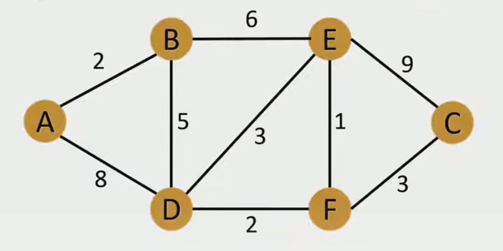
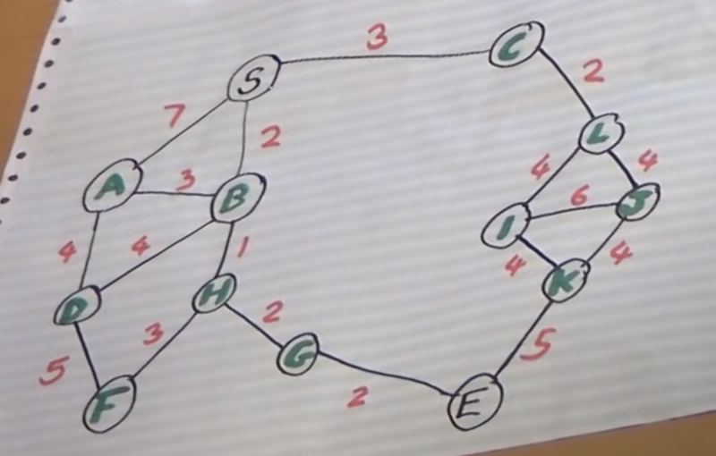

# Assignment F: Graph Data &nbsp; (10 Pts)


### Challenges
- [Challenge 1:](#1-challenge-understanding-graph-data) Understanding Graph Data
- [Challenge 2:](#2-challenge-representing-graph-data-in-python) Representing Graph Data in Python
- [Challenge 3:](#3-challenge-implementing-the-graph-in-python) Implementing the Graph in Python
- [Challenge 4:](#4-challenge-implementing-dijkstras-shortest-path-algorithm) Implementing Dijkstra's Shortest Path Algorithm
- [Challenge 5:](#5-challenge-run-for-another-graph) Run for Another Graph

Points: [1, 1, 2, 4, 2]


&nbsp;
### 1.) Challenge: Understanding Graph Data

A *[Graph](https://en.wikipedia.org/wiki/Graph_theory)*
is a set of nodes (vertices) and edges connecting nodes G = { n ∈ N, e ∈ E }.
A *weighted Graph* has a *weight* (number) associated to each egde.

A *[Path](https://en.wikipedia.org/wiki/Path_(graph_theory))*
is a subset of edges that connects a subset of nodes.
We consider Complete Graphs where all nodes can be reached from any other
node by at least one path (no disconnected subgraphs).

Graphs may have cycles (paths that lead to nodes visited before) or
paths may join at nodes that are part of other paths.

Traversal is the process of visiting each node of a graph exactly once.

Multiple visits of graph nodes by cycles or joins must be detected by
marking visited nodes (which is not preferred since it alters the data set)
or by keeping a separate record of visits.

Write two properties that distinguish graphs from trees.

(1 Pt)


&nbsp;
### 2.) Challenge: Representing Graph Data in Python

Python has no built-in data type that supports graph data.
Separate packages my be used such as
[NetworkX](https://networkx.org/).

In this assignment, we focus on basic Python data structures.

1. How can Graphs be represented in general?

1. How can these by implemented using Python base data structures?

1. Which data structure would be efficient giving the fact that in the
    example below that graph is constant and only traversal operations
    are performed?

(1 Pt)


&nbsp;
### 3.) Challenge: Implementing the Graph in Python

Watch the video and understand how
[Dijkstra's Shortest Path Algorithm](https://en.wikipedia.org/wiki/Dijkstra%27s_algorithm)
(1956) works and which information it needs.

*Edsger W. Dijkstra* (1930-2003,
[bio](https://en.wikipedia.org/wiki/Edsger_W._Dijkstra))
was a Dutch computer scientist, programmer and software engineer.
He was a professor of Computer Science at the Univerity of Austin, Texas
and has received numerous awards, including the
[Turing Award](https://en.wikipedia.org/wiki/Turing_Award)
in 1972.

<!--
[video (FelixTechTips)](https://youtu.be/bZkzH5x0SKU?si=n8Z2ZIfbB73_v1TE)

-->
[Video (Mike Pound, Computerphile)](https://youtu.be/GazC3A4OQTE?si=ZuBEcWaBzuKmPMqA)



Node `S` forms the start of the algorithm, node `E` is the destination.

Draw a sketch of the data structures needed to represent the graph with
nodes, edges and weights and also the data needed for the algorithm.

Create a Python file `shortest_path.py` with

- declarations of data structures you may need for the graph and
    information for the algorithm and

- data to represent the graph in the video with nodes: {A ... K, S} and
    the shown edges with weights.

(2 Pts)


&nbsp;
### 4.) Challenge: Implementing Dijkstra's Shortest Path Algorithm

Implement Dijkstra's Algorithm.

Output the sortest path as sequence of nodes, followed by an analysis and
the shortest distance.

```
shortest path: S -> B -> H -> G -> E
analysis:
S->B(2)
B->H(1)
H->G(2)
G->E(2)
shortest distance is: 7
```
(4 Pts)


&nbsp;
### 5.) Challenge: Run for Another Graph

Run your algorithm for another graph G: {A ... F} with weights:
```
G: {A, B, C, D, E, F}, start: A, end: C

Weights:
AB(2), BE(6), EC(9), AD(8), BD(5),
DE(3), DF(2), EF(1), FC(3)
```

Output the result:

```
shortest path: A -> B -> X -> F -> C
analysis:
S->B(2)
B->D(5)
D->F(2)
F->C(3)
shortest distance is: 12
```
(2 Pts)

